# eons 

**time space manyfolds**   

[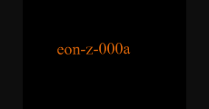](https://sifbuilder.github.com//eons//index.html#eon-z000a)[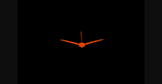](https://sifbuilder.github.com//eons//index.html#eon-z020a-borg)[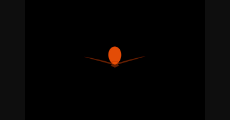](https://sifbuilder.github.com//eons//index.html#eon-z020b-borg)[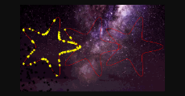](https://sifbuilder.github.com//eons//index.html#eon-z021a)[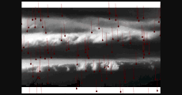](https://sifbuilder.github.com//eons//index.html#eon-z022a)[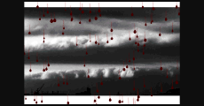](https://sifbuilder.github.com//eons//index.html#eon-z022b)[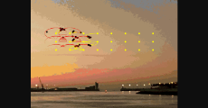](https://sifbuilder.github.com//eons//index.html#eon-z022c)[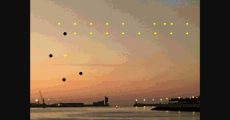](https://sifbuilder.github.com//eons//index.html#eon-z023a)[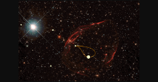](https://sifbuilder.github.com//eons//index.html#eon-z025a)[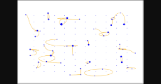](https://sifbuilder.github.com//eons//index.html#eon-z031a)[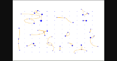](https://sifbuilder.github.com//eons//index.html#eon-z031b)[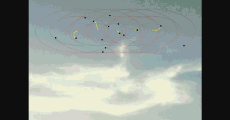](https://sifbuilder.github.com//eons//index.html#eon-z031c)[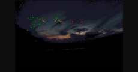](https://sifbuilder.github.com//eons//index.html#eon-z031d)[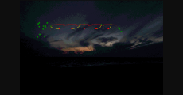](https://sifbuilder.github.com//eons//index.html#eon-z031e)[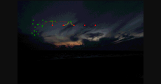](https://sifbuilder.github.com//eons//index.html#eon-z031f)[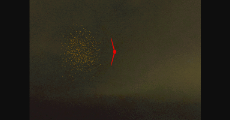](https://sifbuilder.github.com//eons//index.html#eon-z041a)[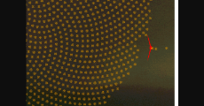](https://sifbuilder.github.com//eons//index.html#eon-z041b)[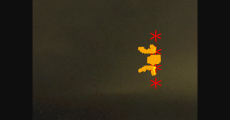](https://sifbuilder.github.com//eons//index.html#eon-z041c)[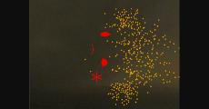](https://sifbuilder.github.com//eons//index.html#eon-z041d)[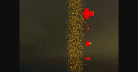](https://sifbuilder.github.com//eons//index.html#eon-z041e)[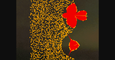](https://sifbuilder.github.com//eons//index.html#eon-z041f)[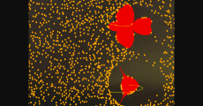](https://sifbuilder.github.com//eons//index.html#eon-z041g)[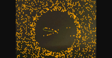](https://sifbuilder.github.com//eons//index.html#eon-z041h)[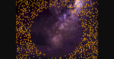](https://sifbuilder.github.com//eons//index.html#eon-z041i)[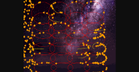](https://sifbuilder.github.com//eons//index.html#eon-z041j)[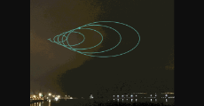](https://sifbuilder.github.com//eons//index.html#eon-z067)[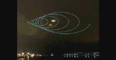](https://sifbuilder.github.com//eons//index.html#eon-z068)[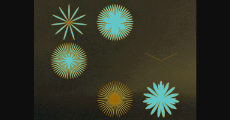](https://sifbuilder.github.com//eons//index.html#eon-z069)[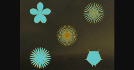](https://sifbuilder.github.com//eons//index.html#eon-z070)[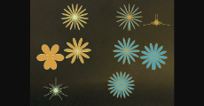](https://sifbuilder.github.com//eons//index.html#eon-z071)[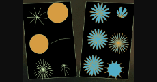](https://sifbuilder.github.com//eons//index.html#eon-z073)[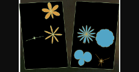](https://sifbuilder.github.com//eons//index.html#eon-z074)[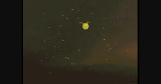](https://sifbuilder.github.com//eons//index.html#eon-z075)[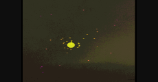](https://sifbuilder.github.com//eons//index.html#eon-z076)[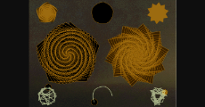](https://sifbuilder.github.com//eons//index.html#eon-z078)[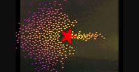](https://sifbuilder.github.com//eons//index.html#eon-z079)[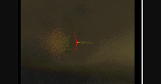](https://sifbuilder.github.com//eons//index.html#eon-z080)[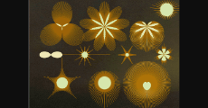](https://sifbuilder.github.com//eons//index.html#eon-z083)[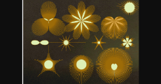](https://sifbuilder.github.com//eons//index.html#eon-z084)[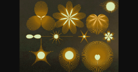](https://sifbuilder.github.com//eons//index.html#eon-z086)[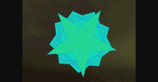](https://sifbuilder.github.com//eons//index.html#eon-z087)[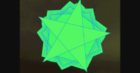](https://sifbuilder.github.com//eons//index.html#eon-z088)[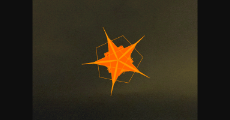](https://sifbuilder.github.com//eons//index.html#eon-z089)[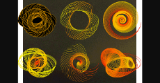](https://sifbuilder.github.com//eons//index.html#eon-z090)[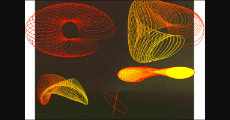](https://sifbuilder.github.com//eons//index.html#eon-z091)[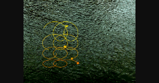](https://sifbuilder.github.com//eons//index.html#eon-z092)[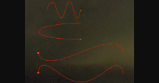](https://sifbuilder.github.com//eons//index.html#eon-z093)[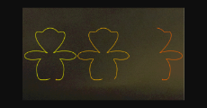](https://sifbuilder.github.com//eons//index.html#eon-z094)[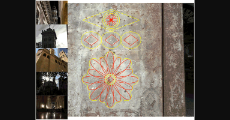](https://sifbuilder.github.com//eons//index.html#eon-z095)[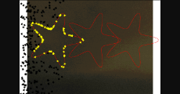](https://sifbuilder.github.com//eons//index.html#eon-z096)[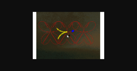](https://sifbuilder.github.com//eons//index.html#eon-z097)[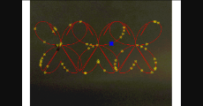](https://sifbuilder.github.com//eons//index.html#eon-z098)[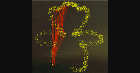](https://sifbuilder.github.com//eons//index.html#eon-z101)[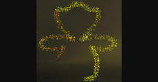](https://sifbuilder.github.com//eons//index.html#eon-z103)[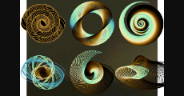](https://sifbuilder.github.com//eons//index.html#eon-z104)[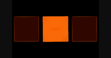](https://sifbuilder.github.com//eons//index.html#eon-z105a-nat-cube)[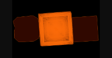](https://sifbuilder.github.com//eons//index.html#eon-z105b-nat)[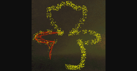](https://sifbuilder.github.com//eons//index.html#eon-z106)[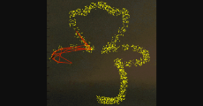](https://sifbuilder.github.com//eons//index.html#eon-z107)[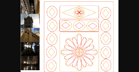](https://sifbuilder.github.com//eons//index.html#eon-z108)[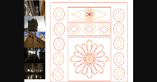](https://sifbuilder.github.com//eons//index.html#eon-z109)[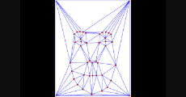](https://sifbuilder.github.com//eons//index.html#eon-z110a-img)[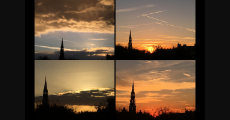](https://sifbuilder.github.com//eons//index.html#eon-z110b-imgs)[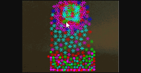](https://sifbuilder.github.com//eons//index.html#eon-z111)[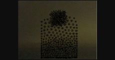](https://sifbuilder.github.com//eons//index.html#eon-z112)[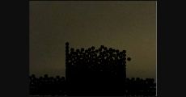](https://sifbuilder.github.com//eons//index.html#eon-z113)[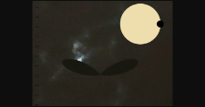](https://sifbuilder.github.com//eons//index.html#eon-z114)[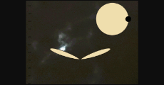](https://sifbuilder.github.com//eons//index.html#eon-z115)[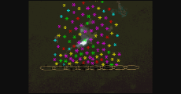](https://sifbuilder.github.com//eons//index.html#eon-z116)[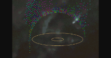](https://sifbuilder.github.com//eons//index.html#eon-z117)[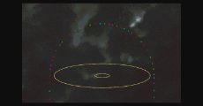](https://sifbuilder.github.com//eons//index.html#eon-z118)[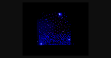](https://sifbuilder.github.com//eons//index.html#eon-z119)[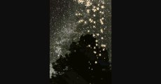](https://sifbuilder.github.com//eons//index.html#eon-z120)[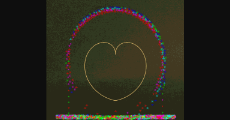](https://sifbuilder.github.com//eons//index.html#eon-z121)[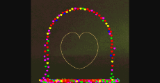](https://sifbuilder.github.com//eons//index.html#eon-z123)[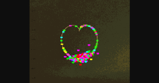](https://sifbuilder.github.com//eons//index.html#eon-z125)[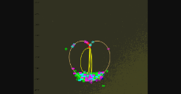](https://sifbuilder.github.com//eons//index.html#eon-z126)[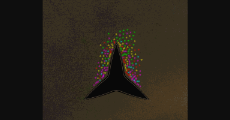](https://sifbuilder.github.com//eons//index.html#eon-z127)[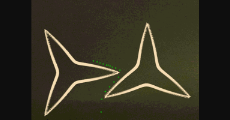](https://sifbuilder.github.com//eons//index.html#eon-z128)[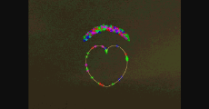](https://sifbuilder.github.com//eons//index.html#eon-z129)[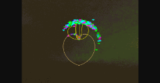](https://sifbuilder.github.com//eons//index.html#eon-z131)[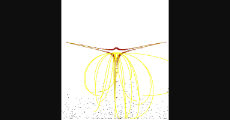](https://sifbuilder.github.com//eons//index.html#eon-z132)[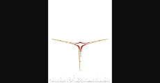](https://sifbuilder.github.com//eons//index.html#eon-z134)[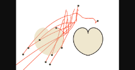](https://sifbuilder.github.com//eons//index.html#eon-z135)[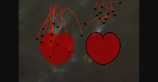](https://sifbuilder.github.com//eons//index.html#eon-z136)[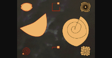](https://sifbuilder.github.com//eons//index.html#eon-z137)[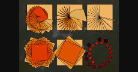](https://sifbuilder.github.com//eons//index.html#eon-z138)[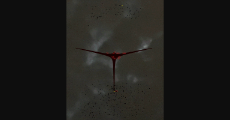](https://sifbuilder.github.com//eons//index.html#eon-z139)[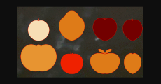](https://sifbuilder.github.com//eons//index.html#eon-z140)[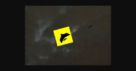](https://sifbuilder.github.com//eons//index.html#eon-z141)[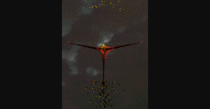](https://sifbuilder.github.com//eons//index.html#eon-z142)[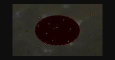](https://sifbuilder.github.com//eons//index.html#eon-z143)[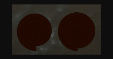](https://sifbuilder.github.com//eons//index.html#eon-z144)[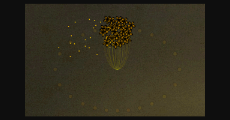](https://sifbuilder.github.com//eons//index.html#eon-z145)[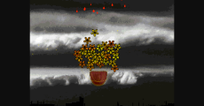](https://sifbuilder.github.com//eons//index.html#eon-z146)[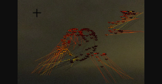](https://sifbuilder.github.com//eons//index.html#eon-z155)[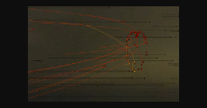](https://sifbuilder.github.com//eons//index.html#eon-z156)[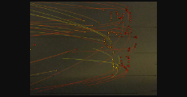](https://sifbuilder.github.com//eons//index.html#eon-z157)[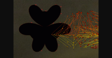](https://sifbuilder.github.com//eons//index.html#eon-z158)[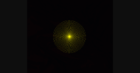](https://sifbuilder.github.com//eons//index.html#eon-z160)[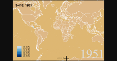](https://sifbuilder.github.com//eons//index.html#eon-z161)[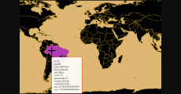](https://sifbuilder.github.com//eons//index.html#eon-z163)[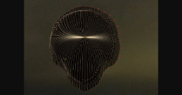](https://sifbuilder.github.com//eons//index.html#eon-z164)[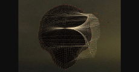](https://sifbuilder.github.com//eons//index.html#eon-z165)[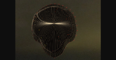](https://sifbuilder.github.com//eons//index.html#eon-z166)[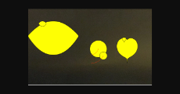](https://sifbuilder.github.com//eons//index.html#eon-z167)[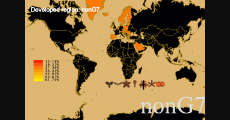](https://sifbuilder.github.com//eons//index.html#eon-z168)[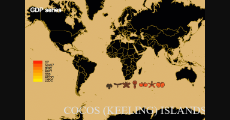](https://sifbuilder.github.com//eons//index.html#eon-z169)[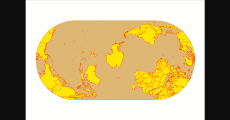](https://sifbuilder.github.com//eons//index.html#eon-z170)[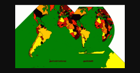](https://sifbuilder.github.com//eons//index.html#eon-z171)[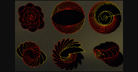](https://sifbuilder.github.com//eons//index.html#eon-z172)[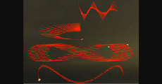](https://sifbuilder.github.com//eons//index.html#eon-z173)[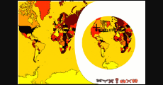](https://sifbuilder.github.com//eons//index.html#eon-z174)[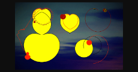](https://sifbuilder.github.com//eons//index.html#eon-z175)[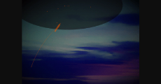](https://sifbuilder.github.com//eons//index.html#eon-z176)[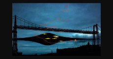](https://sifbuilder.github.com//eons//index.html#eon-z177)[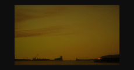](https://sifbuilder.github.com//eons//index.html#eon-z178)[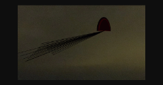](https://sifbuilder.github.com//eons//index.html#eon-z179)[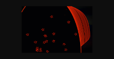](https://sifbuilder.github.com//eons//index.html#eon-z180)[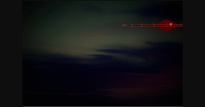](https://sifbuilder.github.com//eons//index.html#eon-z181)[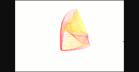](https://sifbuilder.github.com//eons//index.html#eon-z183)[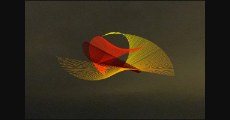](https://sifbuilder.github.com//eons//index.html#eon-z184)[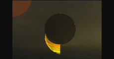](https://sifbuilder.github.com//eons//index.html#eon-z186)[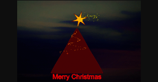](https://sifbuilder.github.com//eons//index.html#eon-z187)[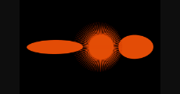](https://sifbuilder.github.com//eons//index.html#eon-z220a-perfectforms)[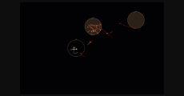](https://sifbuilder.github.com//eons//index.html#eon-z348a)[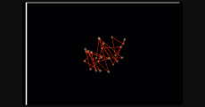](https://sifbuilder.github.com//eons//index.html#eon-z349a)[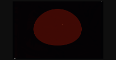](https://sifbuilder.github.com//eons//index.html#eon-z354a)[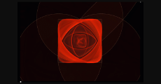](https://sifbuilder.github.com//eons//index.html#eon-z366a)[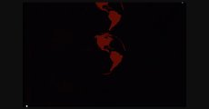](https://sifbuilder.github.com//eons//index.html#eon-z372)[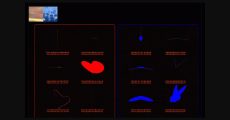](https://sifbuilder.github.com//eons//index.html#eon-z376)[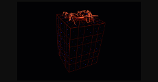](https://sifbuilder.github.com//eons//index.html#eon-z381a)[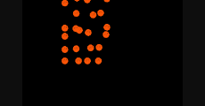](https://sifbuilder.github.com//eons//index.html#eon-z401f-sim-spheres)[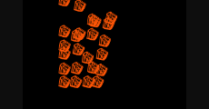](https://sifbuilder.github.com//eons//index.html#eon-z401g-sim-spheres)[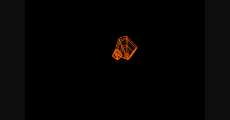](https://sifbuilder.github.com//eons//index.html#eon-z401h-sim-spheres)[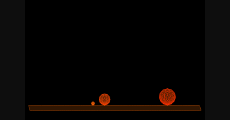](https://sifbuilder.github.com//eons//index.html#eon-z401i-sim-spheres)[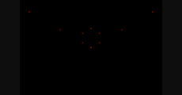](https://sifbuilder.github.com//eons//index.html#eon-z401j-d3sim-spheres)[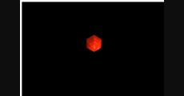](https://sifbuilder.github.com//eons//index.html#eon-z401k-d3sim-upsphere)[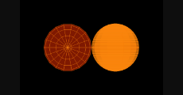](https://sifbuilder.github.com//eons//index.html#eon-z408b-geofil)[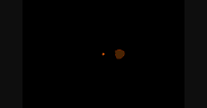](https://sifbuilder.github.com//eons//index.html#eon-z419j-pacer-avatar-nat)[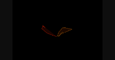](https://sifbuilder.github.com//eons//index.html#eon-z419m-pacer-hand)[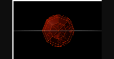](https://sifbuilder.github.com//eons//index.html#eon-z421a-d3earth-pers)[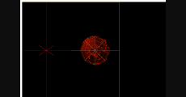](https://sifbuilder.github.com//eons//index.html#eon-z421b-d3earth-ortho)[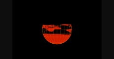](https://sifbuilder.github.com//eons//index.html#eon-z422a-geovase)[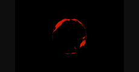](https://sifbuilder.github.com//eons//index.html#eon-z422b-geovase)[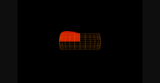](https://sifbuilder.github.com//eons//index.html#eon-z423a-geopols)[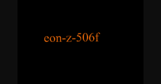](https://sifbuilder.github.com//eons//index.html#eon-z506f)[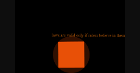](https://sifbuilder.github.com//eons//index.html#eon-z511a-nat-text)[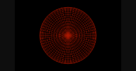](https://sifbuilder.github.com//eons//index.html#eon-z515c-geoearth-wen)[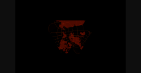](https://sifbuilder.github.com//eons//index.html#eon-z523a-geocox)[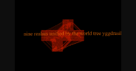](https://sifbuilder.github.com//eons//index.html#eon-z524a-dynafuturi-hedral)[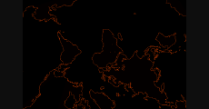](https://sifbuilder.github.com//eons//index.html#eon-z528a-unimercator)[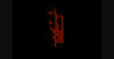](https://sifbuilder.github.com//eons//index.html#eon-z579a-futurecube)[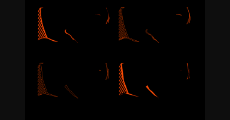](https://sifbuilder.github.com//eons//index.html#eon-z619m-licht)[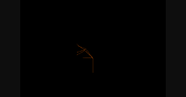](https://sifbuilder.github.com//eons//index.html#eon-z620a-tree)[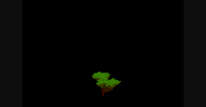](https://sifbuilder.github.com//eons//index.html#eon-z620c-tree)[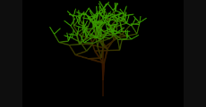](https://sifbuilder.github.com//eons//index.html#eon-z620d-tree)[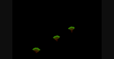](https://sifbuilder.github.com//eons//index.html#eon-z620e-tree)[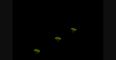](https://sifbuilder.github.com//eons//index.html#eon-z620f-trees)[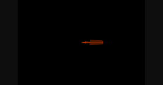](https://sifbuilder.github.com//eons//index.html#eon-z701a-grati-ace)[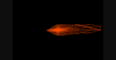](https://sifbuilder.github.com//eons//index.html#eon-z701b-ace2)[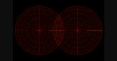](https://sifbuilder.github.com//eons//index.html#eon-z701d-ace3)[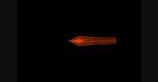](https://sifbuilder.github.com//eons//index.html#eon-z701e-ace4)[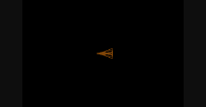](https://sifbuilder.github.com//eons//index.html#eon-z701f-booster)[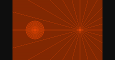](https://sifbuilder.github.com//eons//index.html#eon-z702a-grati-satellite)[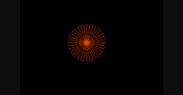](https://sifbuilder.github.com//eons//index.html#eon-z702b-nat)[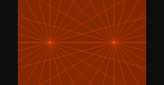](https://sifbuilder.github.com//eons//index.html#eon-z702c-satellite)[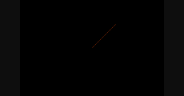](https://sifbuilder.github.com//eons//index.html#eon-z703d-linestring-wen)[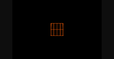](https://sifbuilder.github.com//eons//index.html#eon-z705a-gratiform)[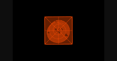](https://sifbuilder.github.com//eons//index.html#eon-z705c-waveform)[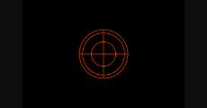](https://sifbuilder.github.com//eons//index.html#eon-z705d-sqhere)[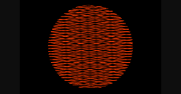](https://sifbuilder.github.com//eons//index.html#eon-z705f-waveform)[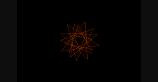](https://sifbuilder.github.com//eons//index.html#eon-z706a-fibonat)[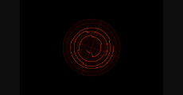](https://sifbuilder.github.com//eons//index.html#eon-z706b-golden)[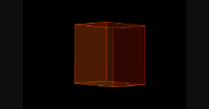](https://sifbuilder.github.com//eons//index.html#eon-z707a-cube)[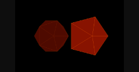](https://sifbuilder.github.com//eons//index.html#eon-z707b-icosahedros)[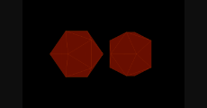](https://sifbuilder.github.com//eons//index.html#eon-z707e-icosahedro)[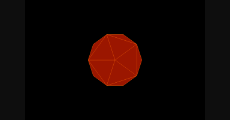](https://sifbuilder.github.com//eons//index.html#eon-z707f-icosahedro)[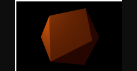](https://sifbuilder.github.com//eons//index.html#eon-z707j-3icosahedro)[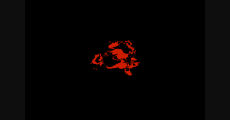](https://sifbuilder.github.com//eons//index.html#eon-z708a-cuber-earth)[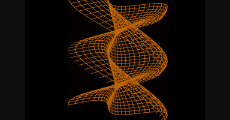](https://sifbuilder.github.com//eons//index.html#eon-z710d-spiral)[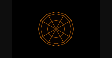](https://sifbuilder.github.com//eons//index.html#eon-z710e-sphere-fn0)[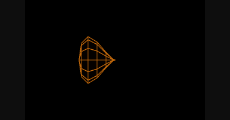](https://sifbuilder.github.com//eons//index.html#eon-z710f-dropfn)[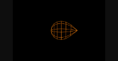](https://sifbuilder.github.com//eons//index.html#eon-z710g-dropnat)[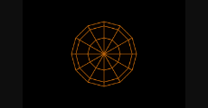](https://sifbuilder.github.com//eons//index.html#eon-z710h-sphere-dax4)[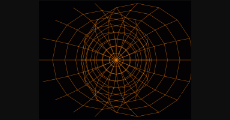](https://sifbuilder.github.com//eons//index.html#eon-z710k)[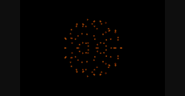](https://sifbuilder.github.com//eons//index.html#eon-z713b-multipoint)[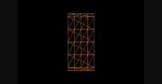](https://sifbuilder.github.com//eons//index.html#eon-z713c-polygon)[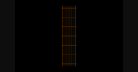](https://sifbuilder.github.com//eons//index.html#eon-z713d-tiles)[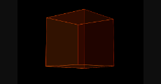](https://sifbuilder.github.com//eons//index.html#eon-z718a-cube-cwen)[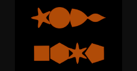](https://sifbuilder.github.com//eons//index.html#eon-z719a-d2forms)[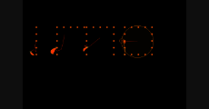](https://sifbuilder.github.com//eons//index.html#eon-z720b-fourier-squares)[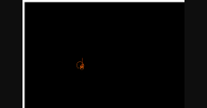](https://sifbuilder.github.com//eons//index.html#eon-z720d-d3fourier-square)[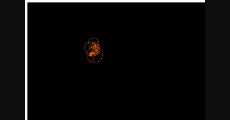](https://sifbuilder.github.com//eons//index.html#eon-z720e-d3fourier-moore)[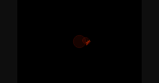](https://sifbuilder.github.com//eons//index.html#eon-z722f-fractals10)[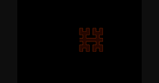](https://sifbuilder.github.com//eons//index.html#eon-z722g-lindenmayer)[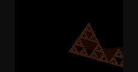](https://sifbuilder.github.com//eons//index.html#eon-z722i-sierpinski)[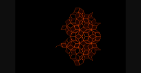](https://sifbuilder.github.com//eons//index.html#eon-z722j-penrose)[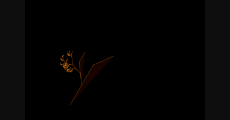](https://sifbuilder.github.com//eons//index.html#eon-z722k-tree)[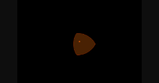](https://sifbuilder.github.com//eons//index.html#eon-z725a-geofuel)[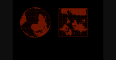](https://sifbuilder.github.com//eons//index.html#eon-z731b-geo-wen)[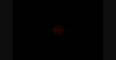](https://sifbuilder.github.com//eons//index.html#eon-z761b-natversor)[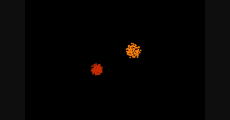](https://sifbuilder.github.com//eons//index.html#eon-z780a-sim-eohal)[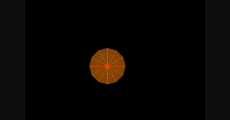](https://sifbuilder.github.com//eons//index.html#eon-z780f-sim-force-gravity)[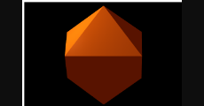](https://sifbuilder.github.com//eons//index.html#eon-z791a-d3icosahedro)[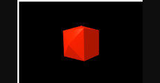](https://sifbuilder.github.com//eons//index.html#eon-z791c-d3catalan)[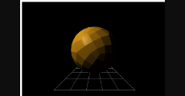](https://sifbuilder.github.com//eons//index.html#eon-z791e-d3-geodesic-rt4)[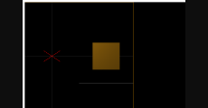](https://sifbuilder.github.com//eons//index.html#eon-z791g-d3cube-ortho)[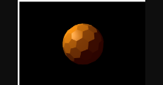](https://sifbuilder.github.com//eons//index.html#eon-z791h-chamfered-truncated-icosahedron)[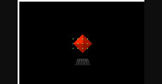](https://sifbuilder.github.com//eons//index.html#eon-z792a-d3octa)[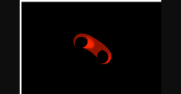](https://sifbuilder.github.com//eons//index.html#eon-z792b-d3torus-twist)[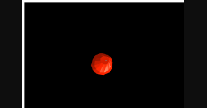](https://sifbuilder.github.com//eons//index.html#eon-z792c-3sphere)[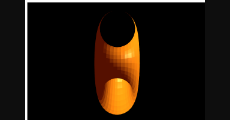](https://sifbuilder.github.com//eons//index.html#eon-z792d-d3tori)[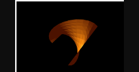](https://sifbuilder.github.com//eons//index.html#eon-z792e-d3borromeo)[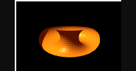](https://sifbuilder.github.com//eons//index.html#eon-z792g-d3torus)[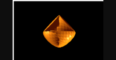](https://sifbuilder.github.com//eons//index.html#eon-z792h-d3squaesphere)[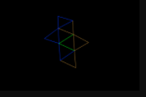](https://sifbuilder.github.com//eons//index.html#eon-z793d-octahedron)[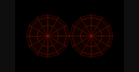](https://sifbuilder.github.com//eons//index.html#eon-z810m-spheres)[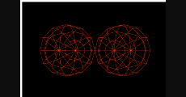](https://sifbuilder.github.com//eons//index.html#eon-z810n-d3spheres)[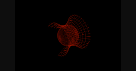](https://sifbuilder.github.com//eons//index.html#eon-z811a-lie)[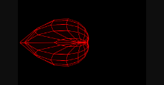](https://sifbuilder.github.com//eons//index.html#eon-z811e-pillows)[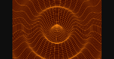](https://sifbuilder.github.com//eons//index.html#eon-z811g-exponential)[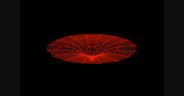](https://sifbuilder.github.com//eons//index.html#eon-z811h-exponential)[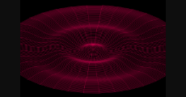](https://sifbuilder.github.com//eons//index.html#eon-z811i-exponential)[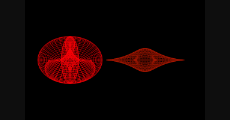](https://sifbuilder.github.com//eons//index.html#eon-z811j-hyperbolic)[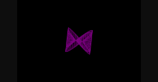](https://sifbuilder.github.com//eons//index.html#eon-z811l-borromeo)[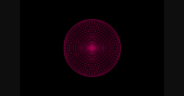](https://sifbuilder.github.com//eons//index.html#eon-z811m-sphere)[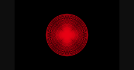](https://sifbuilder.github.com//eons//index.html#eon-z811n-bicone)[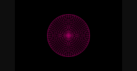](https://sifbuilder.github.com//eons//index.html#eon-z811o-whale)[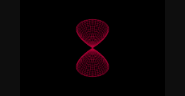](https://sifbuilder.github.com//eons//index.html#eon-z811p-chip)[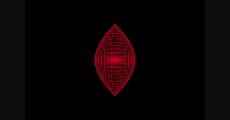](https://sifbuilder.github.com//eons//index.html#eon-z811q-clepsidre)[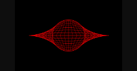](https://sifbuilder.github.com//eons//index.html#eon-z811r-pillow)[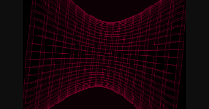](https://sifbuilder.github.com//eons//index.html#eon-z811s-hyperb)[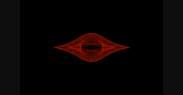](https://sifbuilder.github.com//eons//index.html#eon-z811t-carret)[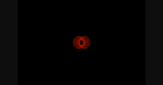](https://sifbuilder.github.com//eons//index.html#eon-z811u-hyper)[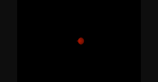](https://sifbuilder.github.com//eons//index.html#eon-z811v-relu)[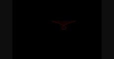](https://sifbuilder.github.com//eons//index.html#eon-z811w-eliptic)[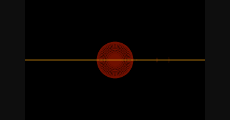](https://sifbuilder.github.com//eons//index.html#eon-z811x-lie)[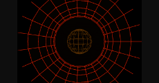](https://sifbuilder.github.com//eons//index.html#eon-z811y-lie)[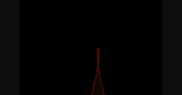](https://sifbuilder.github.com//eons//index.html#eon-z811z-eliptic)[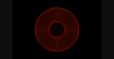](https://sifbuilder.github.com//eons//index.html#eon-z812a-torus)[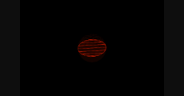](https://sifbuilder.github.com//eons//index.html#eon-z812b-torus-origami)[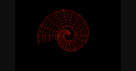](https://sifbuilder.github.com//eons//index.html#eon-z812c-torus-spiral)[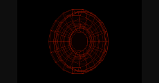](https://sifbuilder.github.com//eons//index.html#eon-z812d-torus)[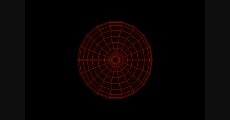](https://sifbuilder.github.com//eons//index.html#eon-z812e-torus)[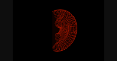](https://sifbuilder.github.com//eons//index.html#eon-z812f-torus)[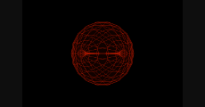](https://sifbuilder.github.com//eons//index.html#eon-z812g-torus)[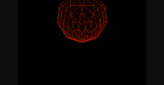](https://sifbuilder.github.com//eons//index.html#eon-z812h-sphere)[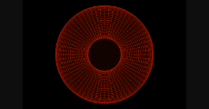](https://sifbuilder.github.com//eons//index.html#eon-z812j-torus)[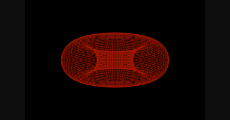](https://sifbuilder.github.com//eons//index.html#eon-z812k-torus)[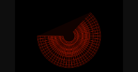](https://sifbuilder.github.com//eons//index.html#eon-z812l-torus)[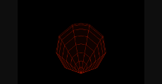](https://sifbuilder.github.com//eons//index.html#eon-z812m-torus-sphere)[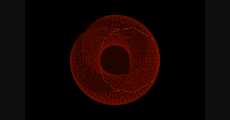](https://sifbuilder.github.com//eons//index.html#eon-z812n-torus)[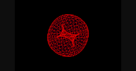](https://sifbuilder.github.com//eons//index.html#eon-z812p-cylisphere)[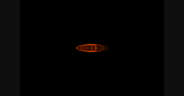](https://sifbuilder.github.com//eons//index.html#eon-z812q-spiral)[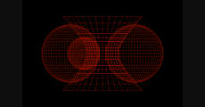](https://sifbuilder.github.com//eons//index.html#eon-z812r-movement)[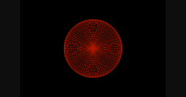](https://sifbuilder.github.com//eons//index.html#eon-z812s-torus-origami)[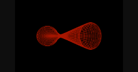](https://sifbuilder.github.com//eons//index.html#eon-z812t-torus-origami)[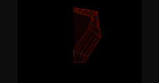](https://sifbuilder.github.com//eons//index.html#eon-z813a-klein)[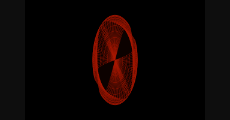](https://sifbuilder.github.com//eons//index.html#eon-z813b-klein)[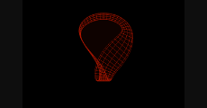](https://sifbuilder.github.com//eons//index.html#eon-z813c-klein)[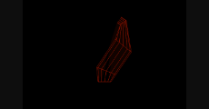](https://sifbuilder.github.com//eons//index.html#eon-z813m-klein)[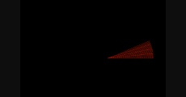](https://sifbuilder.github.com//eons//index.html#eon-z813n-moebious)[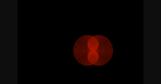](https://sifbuilder.github.com//eons//index.html#eon-z814a-sphere)[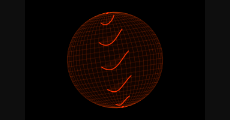](https://sifbuilder.github.com//eons//index.html#eon-z814b-sphere-traces)[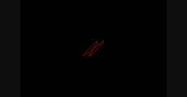](https://sifbuilder.github.com//eons//index.html#eon-z814c-sphere-i)[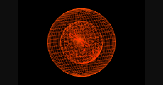](https://sifbuilder.github.com//eons//index.html#eon-z814d-sphere-dark)[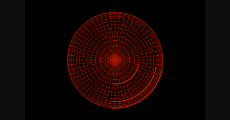](https://sifbuilder.github.com//eons//index.html#eon-z814e-tangerine)[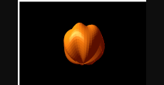](https://sifbuilder.github.com//eons//index.html#eon-z814g-d3tangerine)[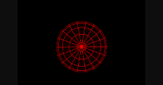](https://sifbuilder.github.com//eons//index.html#eon-z814h-cone)[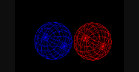](https://sifbuilder.github.com//eons//index.html#eon-z815a-reenter)[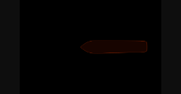](https://sifbuilder.github.com//eons//index.html#eon-z852d-d3grat)[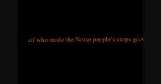](https://sifbuilder.github.com//eons//index.html#eon-z855a-text)
# license  
MIT  